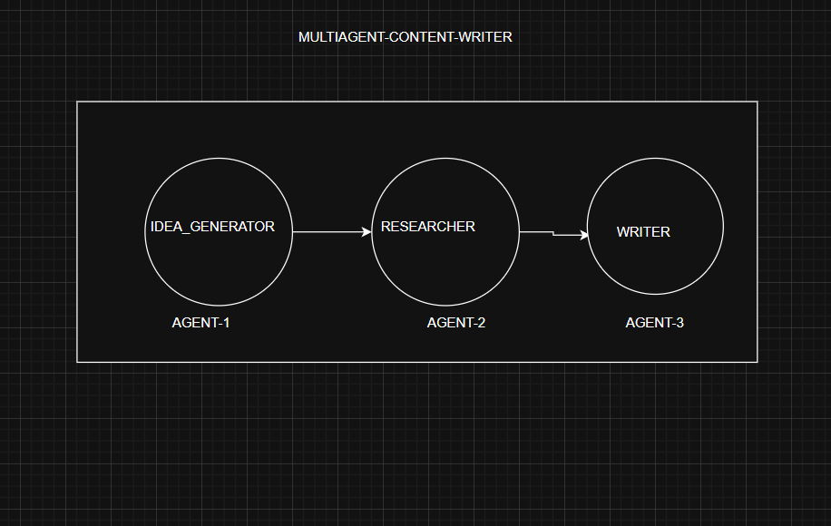

# Multi-Agent Content Writing System




## Overview

The **Multi-Agent Content Writing System** is a sophisticated, Python-based application that leverages a distributed, agent-oriented architecture to automate end-to-end content creation. Designed for scalability and modularity, it employs three specialized autonomous agents—`IdeaGeneratorAgent`, `ResearcherAgent`, and `WriterAgent`—orchestrated via a custom pipeline implemented in `content_pipeline.py`. The system integrates LangChain for agent coordination, Groq's LLaMA3-70B model for high-performance large language model (LLM) inference, and a Streamlit-based web interface for interactive user engagement. Outputs are persistently stored as structured JSON files (`idea_generated.json`, `research_summary.json`, `article_output.json`), supporting downstream integration and auditing.

This project targets advanced users, including AI developers, content engineers, and data scientists, offering a reusable framework for automated content generation across domains such as artificial intelligence, marketing, and healthcare. It addresses challenges like the previously resolved `article_output.json` generation issue through robust error handling and logging.

## Features

- **Agent-Based Ideation**: Dynamically generates domain-specific topic ideas using LLM-driven creativity.
- **Research Automation**: Leverages web search (via Tavily API) and LLM synthesis for comprehensive topic summaries.
- **Adaptive Article Generation**: Produces styled articles with tone selection (e.g., "Conversational", "Professional") based on content analysis.
- **Interactive Web UI**: Streamlit-powered interface with state management (`st.session_state`) for step-wise execution and JSON file downloads.
- **CLI Interface**: Command-line support for batch processing and scripting.
- **Persistent Storage**: JSON-based output files with timestamped metadata for traceability and reuse.

## Installation

### Prerequisites
- Python 3.8+ with `pip` and `virtualenv` (recommended)
- Git for repository cloning

### Setup Instructions
1. Clone the repository:
   ```bash
   git clone https://github.com/your-username/multiagent-content-writer.git
   cd multiagent-content-writer

2. Create and activate a virtual environment:

```bash
python -m venv venv
source venv/bin/activate  # On Windows: venv\Scripts\activate
```

3. Install dependencies:
```bash
pip install --upgrade pip
pip install -r requirements.txt
```

Key dependencies: langchain-groq, groq, streamlit, python-dotenv, langchain, langchain-community.

4. Configure environment variables:

Create a .env file in the root directory with your Groq API key:

```text
GROQ_API_KEY=your_api_key_here
```
Obtain an API key from Groq Console.
5. Initialize the output directory (optional, auto-created on first run):

```bash
mkdir output
```

6. Verify installation:
* Test the CLI: python main.py
* Test the web app: streamlit run app.py


## Usage
Command-Line Interface (CLI)
Execute the pipeline via main.py:

```bash
python main.py
```


* Input a domain (e.g., "AI") and number of ideas (default: 5).
* The system generates ideas, researches the second topic, and writes an article.
* Outputs are saved to output/. Verify with:

```bash 
dir output
type output\article_output.json
```

Web Interface (Streamlit)
Launch the interactive UI:
```bash
streamlit run app.py
```

* Access via http://localhost:8501.
* Workflow:
    1. Enter a domain and number of ideas, click "Generate Ideas" to populate a dropdown.
    2. Select an idea, click "Research Selected Idea" to display a summary.
    3. Click "Generate Article" to render the article and enable JSON downloads.
* Performance: Expect ~1-2s for ideas, 5-10s for research, and 3-5s for article generation (dependent on Groq API latency).

Example Output
Input: Domain = "AI", Ideas = 5
idea_generated.json:

```json

{
    "domain": "AI",
    "timestamp": "2025-04-14T10:39:40.014399",
    "topic_ideas": [
        "Revolutionizing Healthcare: AI's Impact on Medical Diagnosis",
        "The Future of Work: How AI is Changing Job Landscape",
        ...
    ]
}

```

research_summary.json:
```json
{
    "topic": "Revolutionizing Healthcare: AI's Impact on Medical Diagnosis",
    "timestamp": "2025-04-14T10:40:00.000000",
    "summary": "• AI reduces diagnostic errors by 30%...\n• Early disease detection improved..."
}
```
article_output.json:
```json
{
    "topic": "Revolutionizing Healthcare: AI's Impact on Medical Diagnosis",
    "timestamp": "2025-04-14T10:40:10.000000",
    "article": "Revolutionizing Medical Diagnosis: The Power of Artificial Intelligence\n\nImagine a world where..."
}
```


## Project Architecture
### Directory Structure


multiagent-content-writer/
│
├── agents/
│   ├── __init__.py
│   ├── idea_generator.py      # LLM-based topic ideation
│   ├── researcher.py          # Web search and summary generation
│   ├── writer.py              # Article creation with tone adaptation
│
├── workflows/
│   ├── __init__.py
│   ├── content_pipeline.py    # Agent orchestration logic
│
├── output/                    # Persistent storage
│   ├── idea_generated.json
│   ├── research_summary.json
│   ├── article_output.json
│
├── app.py                     # Streamlit web application
├── main.py                    # CLI entry point
├── requirements.txt           # Dependency manifest
└── .env                       # API key configuration


### Technical Components
#### Agents:
* IdeaGeneratorAgent: Utilizes ChatGroq with a custom prompt to generate creative topics.
* ResearcherAgent: Integrates LangChain’s initialize_agent with Tavily search for data synthesis (note: uses deprecated Chain.run, pending LangGraph migration).
* WriterAgent: Employs ChatGroq with a tone-selection algorithm (determine_tone) for article generation.
* Pipeline: content_pipeline.py sequences agent execution, ensuring data flow via JSON files.
* Interfaces:
    * app.py: Streamlit app with st.session_state for state persistence and interactive controls.
    * main.py: CLI with input parsing and output verification.


### Data Flow
* Input: User-defined domain and idea count.
Processing:
* IdeaGeneratorAgent → idea_generated.json → ResearcherAgent → research_summary.json → WriterAgent → article_output.json.
* Output: JSON files and UI/CLI display.


### Technical Considerations
* Performance: Optimized with Groq’s low-latency API (~10-15s total runtime for full pipeline).
* Error Handling: writer.py includes specific exception handling for file I/O (e.g., PermissionError, OSError) to resolve article_output.json generation issues.
* Scalability: Modular agents support extension (e.g., adding an editor agent).
* Dependencies: Managed via requirements.txt, with version pinning recommended for reproducibility.